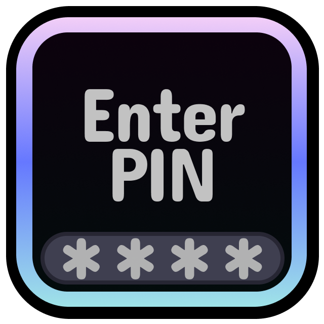

# Safety Lock

**Protect younger siblings from unrated levels!**

> [!NOTE]
> I made this for my cousin's little brother but I thought other people could use it too if they're in a
> similar situation like me of wanting to protect younger people that they might let play on their pc from.. _certain things............_

# [Install](https://geode-sdk.org/mods/xnasuni.safetylock)

unfrequently asked questions:

- can't the mod just be disabled
  > yeah but the target audience is supposed to be kids and 
  > the silent option makes it harder to tell you're even restricted 
  > by hiding stuff instead of locking it away and making it seamless 
  > they wouldn't have an incentive to try to remove it.. ? idk I tried my best; it would still be easily disabled with safe mode and even then probably not be allowed if I prevented the mod from being disabled/uninstalled until you put in the pin so this is fine enough I think for the use case thanks bye
